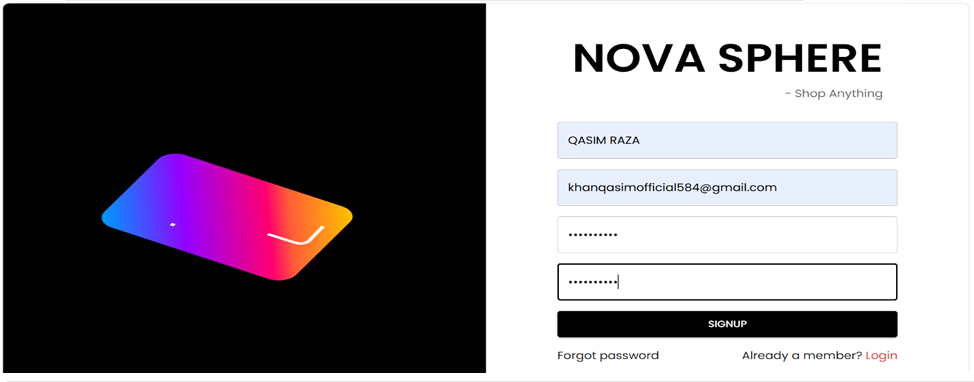
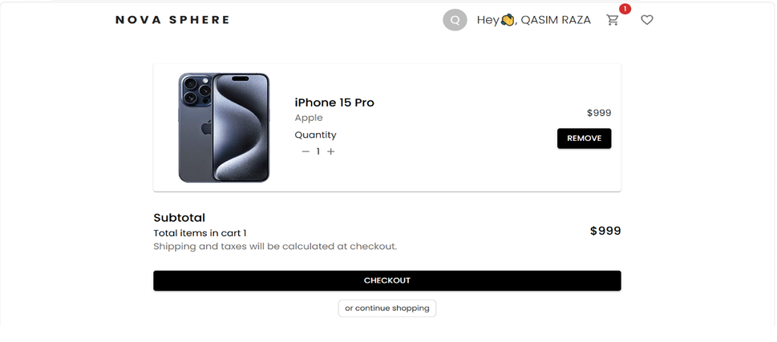

# 🛒 Nova Sphere Ecommerce

A modern full-stack MERN Ecommerce platform built with React, Node.js, Express, and MongoDB.

Nova Sphere provides a complete online shopping experience including user authentication, product browsing, wishlist management, cart functionality, order processing, and an admin dashboard for managing products and customers.

---

# 🚀 Live Features

## Customer Features

- User Registration & Login
- JWT Authentication
- Browse Products
- Search Products
- Product Details Page
- Wishlist Management
- Shopping Cart
- Address Management
- Order Placement
- Order History
- Responsive UI

## Admin Features

- Admin Dashboard
- Add Products
- Update Products
- Delete Products
- Manage Categories
- Manage Brands
- Manage Orders
- Manage Users

---

# 🛠 Tech Stack

## Frontend

- React.js
- Redux Toolkit
- React Router DOM
- Material UI (MUI)
- Axios
- Framer Motion

## Backend

- Node.js
- Express.js
- MongoDB
- Mongoose
- JWT Authentication
- BcryptJS
- Nodemailer

## Database

- MongoDB

---

# 📂 Project Structure

```text
nova-sphere-ecommerce/
│
├── backend/
│   ├── controllers/
│   ├── middleware/
│   ├── models/
│   ├── routes/
│   ├── utils/
│   └── index.js
│
├── frontend/
│   ├── src/
│   │   ├── features/
│   │   ├── pages/
│   │   ├── components/
│   │   ├── app/
│   │   └── assets/
│
├── screenshots/
│
└── README.md
```

---

# 📸 Screenshots

## Home Page


---

## Login Page



---

## Cart Page



---

# 🔑 Main Modules

### Authentication

- Signup
- Login
- Logout
- Protected Routes
- JWT Token Verification

### Product Management

- Product Listing
- Product Details
- Product Search
- Product Filtering
- Product Categories
- Product Brands

### Shopping Features

- Add To Cart
- Update Quantity
- Remove From Cart
- Wishlist
- Checkout

### Admin Panel

- Product CRUD
- Brand CRUD
- Category CRUD
- Order Management
- User Management

---

# ⚙️ Installation Guide

## 1. Clone Repository

```bash
git clone https://github.com/qasimkhan107/nova-sphere-ecommerce.git
```

```bash
cd nova-sphere-ecommerce
```

---

## 2. Install Backend Dependencies

```bash
cd backend
npm install
```

---

## 3. Configure Environment Variables

Create a `.env` file inside the backend folder:

```env
MONGO_URI=mongodb://127.0.0.1:27017/ecommerce

ORIGIN=http://localhost:3000

SECRET_KEY=mysecretkey123

LOGIN_TOKEN_EXPIRATION=30d
PASSWORD_RESET_TOKEN_EXPIRATION=2m

OTP_EXPIRATION_TIME=120000

COOKIE_EXPIRATION_DAYS=30
```

---

## 4. Run Backend Server

```bash
npm run dev
```

Backend runs on:

```text
http://localhost:8000
```

---

## 5. Install Frontend Dependencies

Open a new terminal:

```bash
cd frontend
npm install
```

---

## 6. Run Frontend

```bash
npm start
```

Frontend runs on:

```text
http://localhost:3000
```

---

# 📦 Database

MongoDB Collections:

- Users
- Products
- Categories
- Brands
- Cart
- Wishlist
- Orders
- Addresses

---

# 🔒 Security

- Password Hashing using BcryptJS
- JWT Authentication
- Protected Admin Routes
- Secure Cookie Authentication

---

# 🎯 Future Improvements

- Payment Gateway Integration
- Product Reviews & Ratings
- Email Notifications
- Inventory Analytics
- Sales Dashboard
- Coupon System
- Multi Vendor Support

---

# 👨‍💻 Developer

**Qasim Raza**

Full Stack MERN Developer

GitHub:
https://github.com/qasimkhan107

Repository:
https://github.com/qasimkhan107/nova-sphere-ecommerce

---

# 📄 License

This project is developed for educational and portfolio purposes.

© 2026 Qasim Raza. All Rights Reserved.